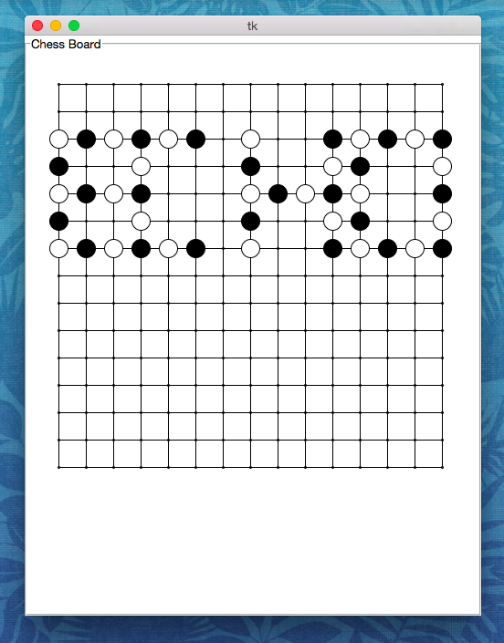

#GOMOKU

##Overview
*Gomoku*, a very easy and light computher game implemented with python and Tkinter.

Gomoku, 这是一个非常简单的轻量级的电脑游戏，这款游戏被用Python语言和Tkinter图形库实现。

##Screenshot

##Version
* ###version 1.0
	Basic Functions that you can play with other player
	实现了可以去其他玩家一起下棋的基本功能
	
##Donate
if you like my application, you can donate for us. And we will release update and support more and more good applications.
如果你喜欢我的应用，你可以给我捐款。这样鼓励我们推出更多更新，并提供越来越好的应用。
